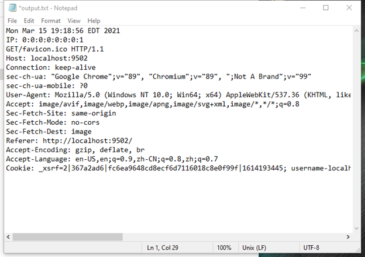
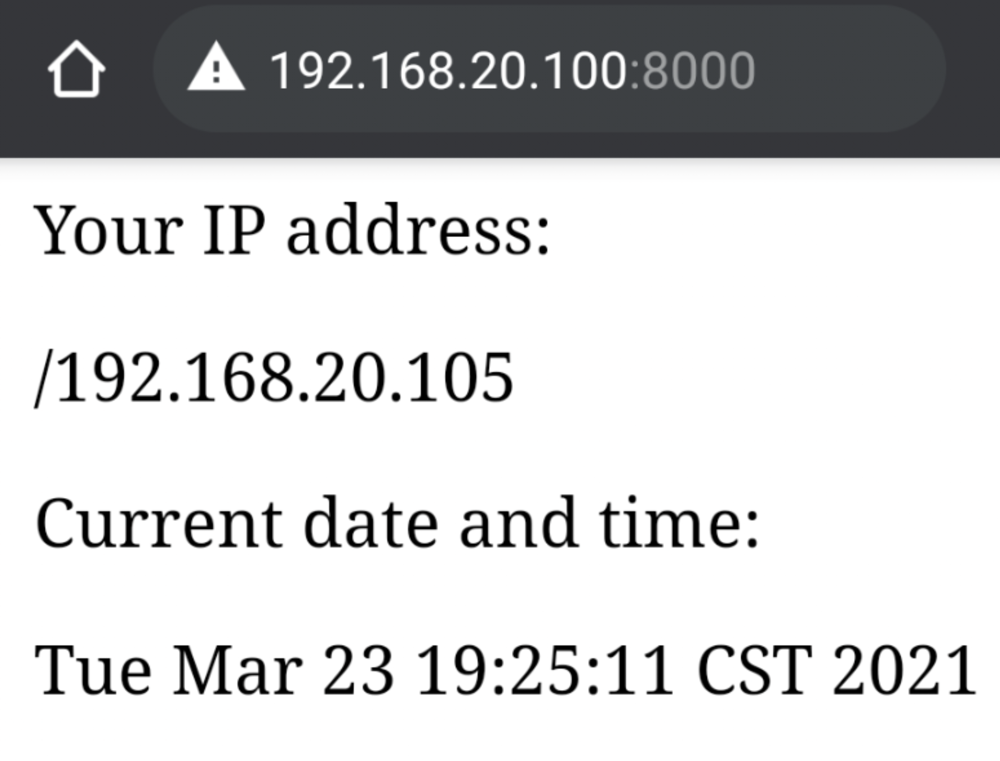
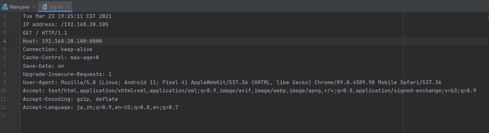

## **CIS3329 Lab5 Simple Web Server With Output**
## Requirement:
Write a program which listens on a TCP port specified at run time. When a connection is made, the server sends back an HTTP 200 response and HTML text, which when shown in a browser, will display:

> Your IP address is: "IP Address"
> 
> Current date and time:WWW MMM dd hr:mi:se yyyy

And this program will output a log file which looks like:

## Screenshots:

